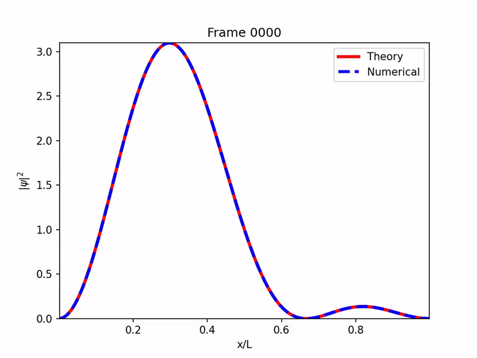
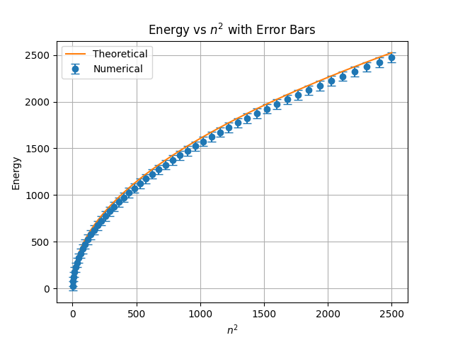
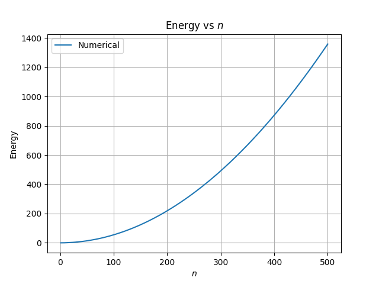

# Schrödinger Equation Solutions

* Solution of the particle in a box (infinite potential well).
* The time-independent Schrödinger equation is solved using the finite difference method.
* Expansion coefficients $(c_n)$ are computed by projecting the initial state onto energy eigenstates.
* Superpositions of eigenstates are used to construct the initial wavefunction $\ket{\psi}_0$.
* The wavefunction is evolved in time using the eigenvalue spectrum.

## Infinite Potential well
### Time Evoluation

- Time Evoluation of infinite_well,where $\ket{\psi}_s = \frac{1}{ \sqrt(2)} [\ \ket{\psi}_0 + \ket{\psi}_1$]
### $Engery\ \mathrm{vs} \ n^2$

- quantum number (n) = 10

## Harmonic Potential
### Time Evoluation

- Time Evoluation of harmonic,where $\ket{\psi}_s = \frac{1}{ \sqrt(2)} [\ \ket{\psi}_0 + \ket{\psi}_1$]
### $Engery\ \mathrm{vs} \ n^2$

- quantum number (n) = 50

## Finite Barrier Potential
### Time Evoluation

- Time Evoluation of finite_barrier,where $\ket{\psi}_s = \frac{1}{ \sqrt(2)} [\ \ket{\psi}_0 + \ket{\psi}_1$]
### $Engery\ \mathrm{vs} \ n$

- quantum number (n) = 50

## Equations used
### Schrödinger Time Dependent Equation

$$
 -\frac{\hbar^2}{2m} \frac{\partial^2 \psi(x,t)}{\partial x^2} + V(x)\psi(x,t)
= i\hbar \frac{\partial \psi(x,t)}{\partial t}
$$

### Solution in Discrete

$$
\psi(x,t) = \sum_n c_n\, \phi_n(x)\, e^{-i E_n t / \hbar}
$$

where

$$
c_n = \sum_x \phi_n^*(x)\,\psi(x,0)\, dx
$$

### Derived Hamiltonian

$$
H =
\begin{pmatrix}
A_1 & B & 0 & \cdots & 0 \\
B & A_2 & B & \cdots & 0 \\
0 & B & A_3 & \cdots & 0 \\
\vdots & \vdots & \vdots & \ddots & B \\
0 & 0 & 0 & B & A_N
\end{pmatrix}
$$

where

$$
B = -\frac{\hbar^2}{2m(\Delta x)^2}
$$

$$
A_j = \frac{\hbar^2}{m(\Delta x)^2} + V(x_j)
$$
