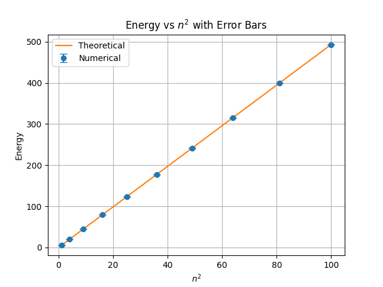

# Schrödinger Equation Solutions

* Solution of the particle in a box (infinite potential well).
* The time-independent Schrödinger equation is solved using the finite difference method.
* Expansion coefficients $(c_n)$ are computed by projecting the initial state onto energy eigenstates.
* Superpositions of eigenstates are used to construct the initial wavefunction $\psi_0$.
* The wavefunction is evolved in time using the eigenvalue spectrum.

## Time Evolution

* Time evolution where $\psi_s = \frac{1}{\sqrt{2}}\left[\psi_0 + \psi_1\right]$

## Energy vs $n^2$

* Quantum number $(n) = 10$

## Equations used

**Schrödinger Time Dependent Equation**
$$
-\frac{\hbar^2}{2m} \frac{\partial^2 \psi(x,t)}{\partial x^2}

* V(x)\psi(x,t)
  = i\hbar \frac{\partial \psi(x,t)}{\partial t}
  $$

**Solution in discrete**
$$
\psi(x,t) = \sum_n c_n, \phi_n(x), e^{-i E_n t / \hbar}
$$

**where:**
$$
c_n = \sum_x \phi_n^*(x),\psi(x,0), dx
$$

**Derived Hamiltonian**

$$
H =
\begin{pmatrix}
A_1 & B & 0 & \cdots & 0 \
B & A_2 & B & \cdots & 0 \
0 & B & A_3 & \cdots & 0 \
\vdots & \vdots & \vdots & \ddots & B \
0 & 0 & 0 & B & A_N
\end{pmatrix}
$$

**where**

$$
B = -\frac{\hbar^2}{2m(\Delta x)^2}
$$

$$
A_j = \frac{\hbar^2}{m(\Delta x)^2} + V(x_j)
$$

